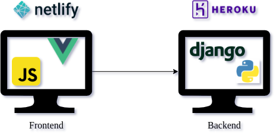

# To-Do items App

SPA application that manages task folders.

## Architecture

The frontend was developed with Vue.js and the backend with Django REST Framework.



## Usage

- Frontend UI: https://to-do-items-ui.netlify.app/
- Backend API: https://to-do-items-api.herokuapp.com/

## Local execution

### Requirements

- Python v3.8.10
- NPM v6.14.6
- Node v10.19.0
- *Make sure ports 8000 and 8080 are free*

### Install

1. Clone the repository:
   ``` git clone git@github.com:Pastorsin/to-do-items.git```
2. Move to the root folder:
   ```cd to-do-items```
3. Run the following script:
   ```chmod +x run.sh && ./run.sh```

### Usage

- Frontend UI: http://localhost:8080/
- Backend API: http://localhost:8000/

